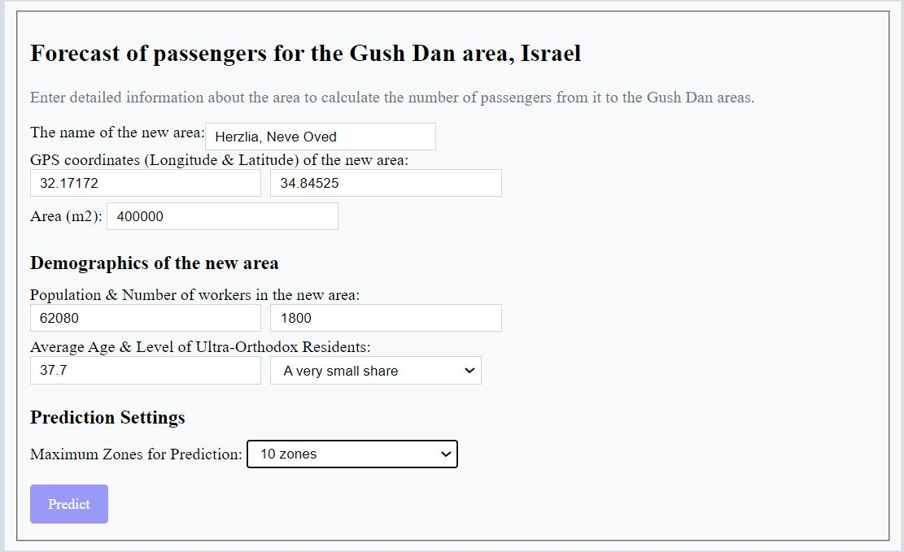
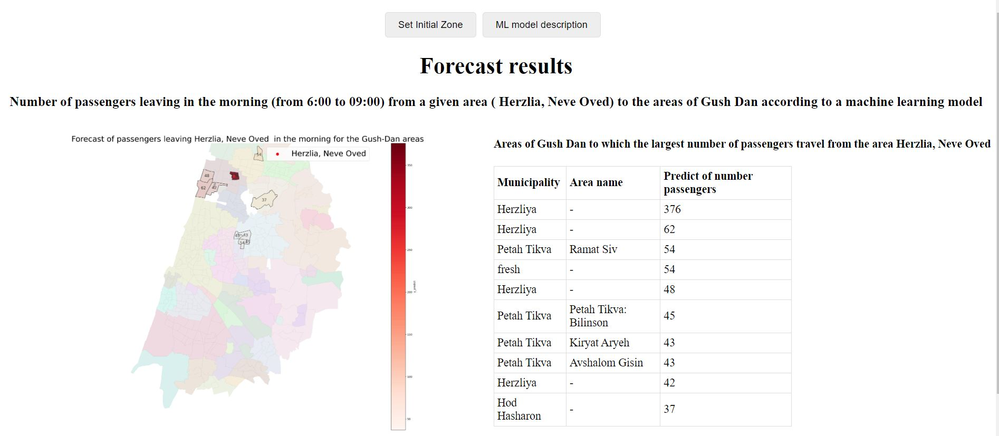
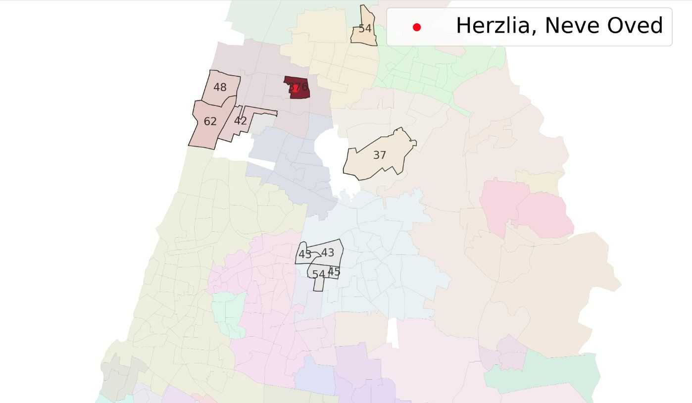

# **Project name: Solving transportation problems using machine learning.**

## **The main goal of the project**:
Predict the number of passengers from one place to another during rush hour in the mornings during the week (days from Sunday to Thursday).

## **Target variable**
 **Target variable** -  the number of passengers traveling from one place to another (from zone A to the zone B) during the morning rush hour from 6:00-9:00 (Morning_rush_6_9).

## **Data used for the project**:
The project used Israeli data to implement machine learning models, which are publicly available on the website of the government: https://data.gov.il/

1. The Survey of traveling passengers by hour and from each zone to each zone in Israel: https://data.gov.il/dataset/tripscelular_1819
2. Statistical data and geodata for each zone in Israel: https://data.gov.il/dataset/tripscelular_1819
3. Motorate data - number of cars per 1000 inhabitants in each zone: https://data.gov.il/dataset/taz_mot_rate_2040  
4. Data and geodata of all industrial zones in Israel: https://data.gov.il/dataset/industrial
5. Job density data for each zone in Israel: https://data.gov.il/dataset/2030
6. Location data for fast train stops: https://data.gov.il/dataset/lrt_stat
7. Location data for bus lines with a large number of passengers: https://data.gov.il/dataset/tma_23a4_lines

## **Composition of the work**
This work consists of 4 parts:
* 1 part. Data preparation
* 2 part. EDA, Missing values
* 3 part. Machine learning models
* 4 part. Deployment

## **Example usage**
At the first stage, we enter the data of the area we are interested in (geographical, statistical, demographic data) and press the "Predict" button:

  

Next, a machine learning model is run to evaluate the results, with the additional ability to present the results on a map of the Gush Dan region.
The user receives the result in the form of a map and table of areas in Gush Dan to which the largest number of passengers will go:

  

It is possible to click on the map to enlarge it. You can consider the location of the districts and how many passengers will go to each district:

  

