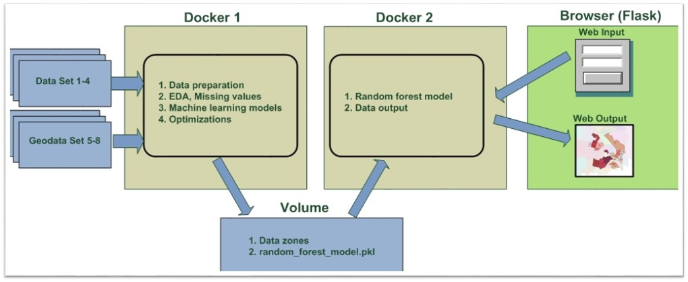

# **Project name: Solving transportation problems using machine learning.**

## **The main goal of the project**:
Predict the number of passengers from one place to another during rush hour in the mornings during the week (days from Sunday to Thursday).

## **Target variable**
 **Target variable** -  the number of passengers traveling from one place to another (from zone A to the zone B) during the morning rush hour from 6:00-9:00 (Morning_rush_6_9).

## **Data used for the project**:
The project used Israeli data to implement machine learning models, which are publicly available on the website of the government: https://data.gov.il/

1. The Survey of traveling passengers by hour and from each zone to each zone in Israel: https://data.gov.il/dataset/tripscelular_1819
2. Statistical data and geodata for each zone in Israel: https://data.gov.il/dataset/tripscelular_1819
3. Motorate data - number of cars per 1000 inhabitants in each zone: https://data.gov.il/dataset/taz_mot_rate_2040  
4. Data and geodata of all industrial zones in Israel: https://data.gov.il/dataset/industrial
5. Job density data for each zone in Israel: https://data.gov.il/dataset/2030
6. Location data for fast train stops: https://data.gov.il/dataset/lrt_stat
7. Location data for bus lines with a large number of passengers: https://data.gov.il/dataset/tma_23a4_lines
8. Average speed of buses during morning rush hour: https://data.gov.il/dataset/bus_speed
9. University layer: https://data.gov.il/dataset/universities
    

## **Composition of the work**
This project uses a supervised learning approach, using algorithms and models to predict the number of trips from one zone to another zone.
The project tested the effectiveness of algorithms and models such as Logistic Regression, Linear Regression, Decision Tree, Random Forest, Gradient Boosting, SVM, ADABoost, results optimization techniques such as Normalization and Standardization of parameters, selection of Hyperparameters for models (using GridSearchCV ) and use Cross-Validation to identify the best performing model for that prediction task.

This work consists of 4 parts:
* 1 part. Data preparation
* 2 part. EDA, Missing values
* 3 part. Machine learning models
* 4 part. Deployment

  

<h3>  Consists of 2 dockers</h3>

1. Docker1 contains Python code that receives data, processes and analyzes the data. Burns non-lost data and zeros. Runs various machine learning models with optimal hyperparameters and selects the optimal model with the best result. The final model and necessary data are saved in a shared folder.

2. Docker2 receives the model parameters, requests the user to provide the necessary area data for analysis (using Flask framework - web applications in the Python). Launches the optimal machine learning model. Displays the result in the browser in the form of a table and map.

## **Example usage**
At the first stage, we enter the necessary data for the area of ​​interest to us, enter geographical, statistical and demographic data) and click the “Predict” button:

  

Next, a machine learning model is run to evaluate the results, with the additional ability to present the results on a map of the Gush Dan region.
The user receives the result in the form of a map and table of areas in Gush Dan to which the largest number of passengers will go:

  

It is possible to click on the map to enlarge it. You can consider the location of the districts and how many passengers will go to each district:

  

